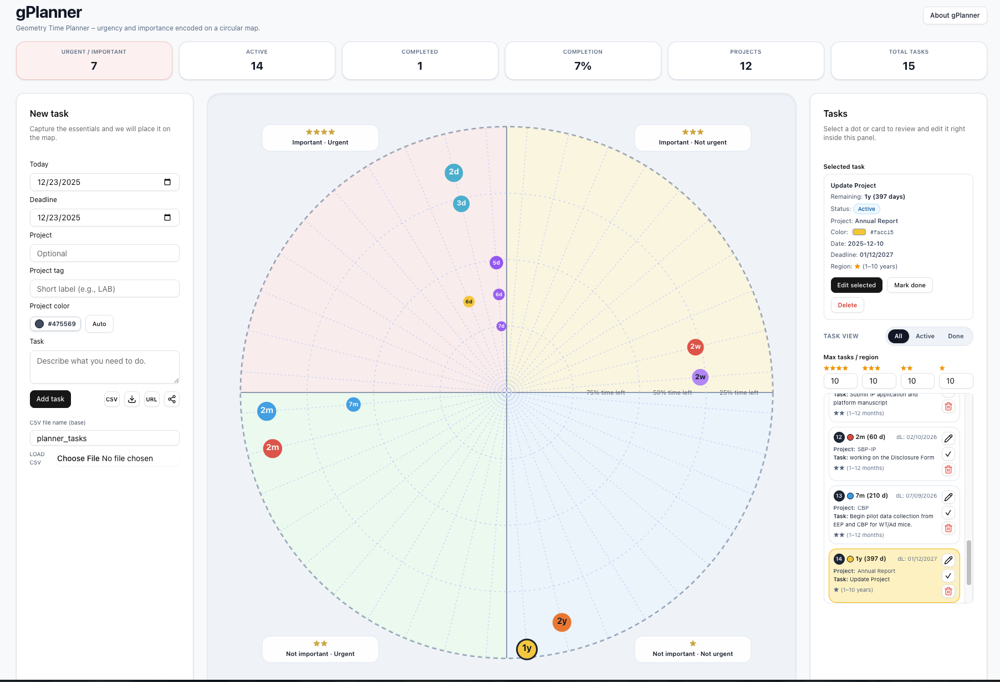

# gPlanner – Geometry Time Planner

gPlanner is a visual task-planning app that encodes urgency and importance directly on a circular “geometry” map. Tasks are represented as colored dots whose position and color encode both priority and remaining time to the deadline.

The app runs entirely in your browser (local Next.js app) and stores data in `localStorage` and optional CSV files. There is no backend: your schedule is private to your machine unless you explicitly share CSV or text exports.

---




---


## 1. Concept: How the Geometry Works

The planner circle is split into four regions (quadrants):

- Top-left: **★★★★ Important – Urgent** (1–7 days)
- Top-right: **★★★ Important – Not urgent** (1–4 weeks)
- Bottom-left: **★★ Not important – Urgent** (1–12 months)
- Bottom-right: **★ Not important – Not urgent** (1–10 years)

Each task is shown as a **colored circle**:

- **Red**: days (1–7 d)
- **Dark yellow**: weeks (1–4 w)
- **Green**: months (1–12 m)
- **Blue**: years (1–10 y)

Inside each dot you see a compact label such as `3d`, `2w`, `5m`, or `4y` indicating remaining time in that scale. The exact number of days remaining is displayed in the Selected Task panel.

The rings and percentages (25%, 50%, 75%) indicate how much time is left within each region, with the current design:

- The **center** represents the earliest part of that region.
- The **outer edge** represents the most urgent part of that region.
- As the deadline moves closer, the dot moves toward the outer edge of its region.

---

## 2. Installing and Running Locally

You need Node.js (v18+ recommended) and npm.

1. Clone the repository:
   ```bash
   git clone git@github.com:merang2050/gPlanner.git
   cd gPlanner


This is a [Next.js](https://nextjs.org) project bootstrapped with [`create-next-app`](https://nextjs.org/docs/app/api-reference/cli/create-next-app).

## Getting Started

First, run the development server:

```bash
npm run build
# 
then
#
npm run start
```

Open [http://localhost:3000](http://localhost:3000) with your browser to see the result.

You can start editing the page by modifying `app/page.tsx`. The page auto-updates as you edit the file.

This project uses [`next/font`](https://nextjs.org/docs/app/building-your-application/optimizing/fonts) to automatically optimize and load [Geist](https://vercel.com/font), a new font family for Vercel.

## Learn More

To learn more about Next.js, take a look at the following resources:

- [Next.js Documentation](https://nextjs.org/docs) - learn about Next.js features and API.
- [Learn Next.js](https://nextjs.org/learn) - an interactive Next.js tutorial.

You can check out [the Next.js GitHub repository](https://github.com/vercel/next.js) - your feedback and contributions are welcome!

## Deploy on Vercel

The easiest way to deploy your Next.js app is to use the [Vercel Platform](https://vercel.com/new?utm_medium=default-template&filter=next.js&utm_source=create-next-app&utm_campaign=create-next-app-readme) from the creators of Next.js.

Check out our [Next.js deployment documentation](https://nextjs.org/docs/app/building-your-application/deploying) for more details.


## Run gPlanner App (Vercel)

https://g-planner-eight.vercel.app/

